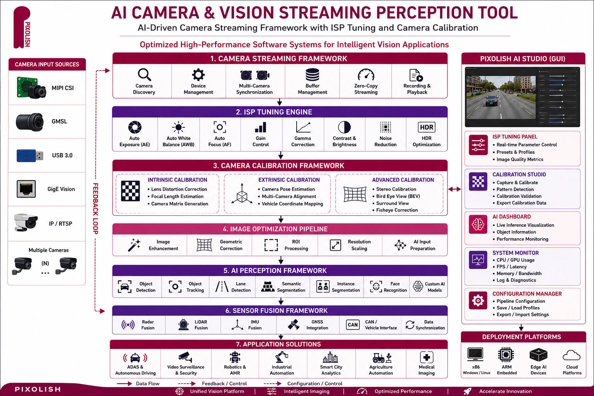
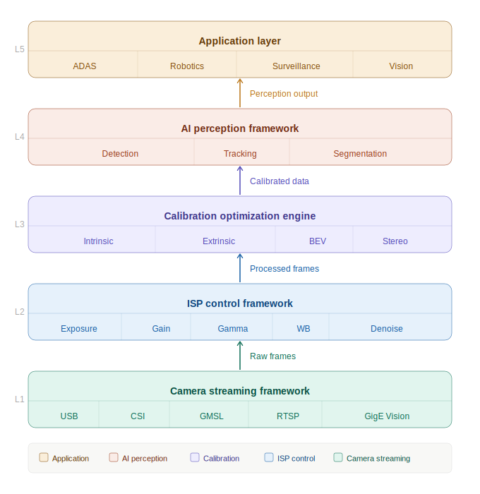
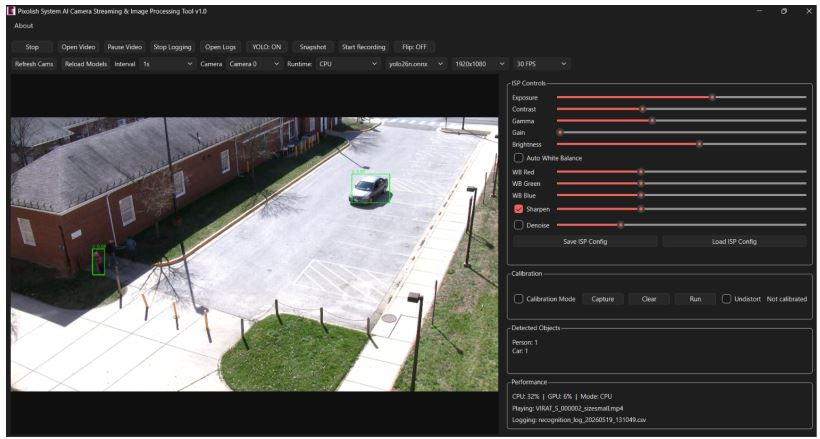
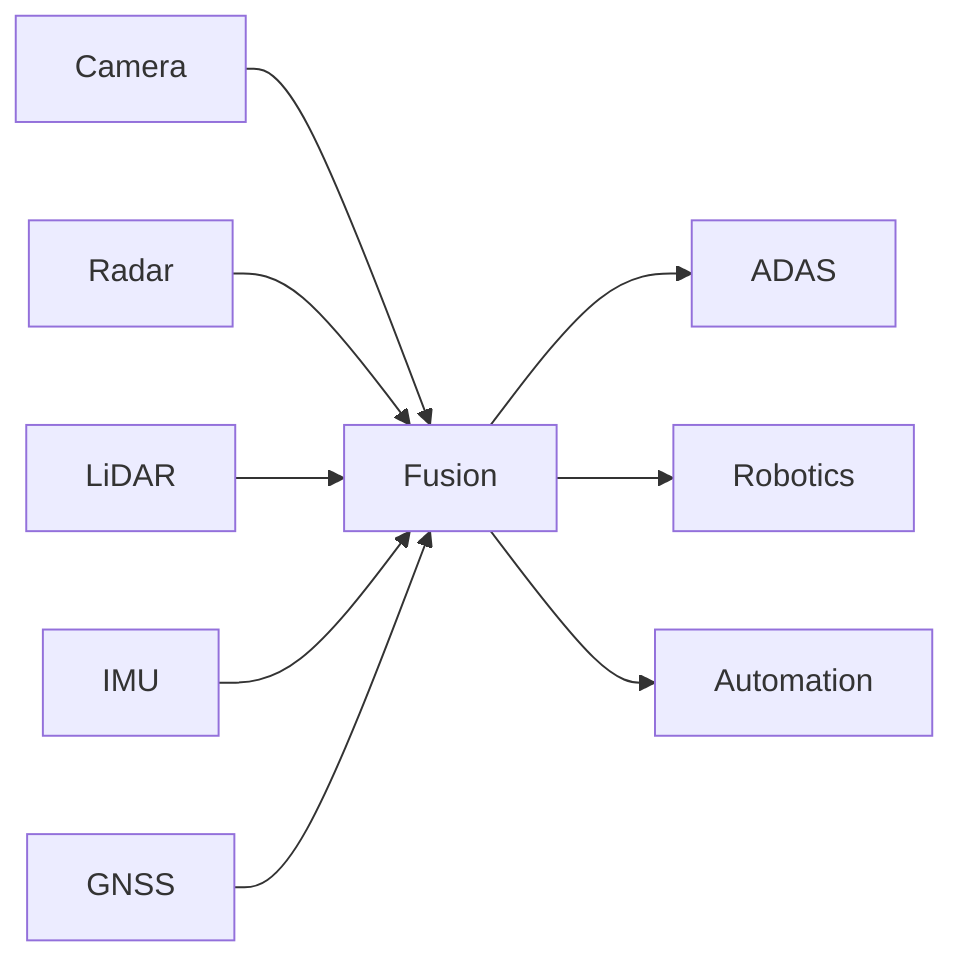

# AICameraStreaming
AI-Driven Camera Streaming Framework is a unified software platform integrating camera streaming, ISP control, automated calibration, and AI-ready vision processing. It accelerates the development of high-performance machine vision solutions for ADAS, video surveillance, robotics, and industrial automation, reducing complexity and time-to-market
# <div align="center">



# Pixolish AI Vision Streaming & Perception Studio

### Camera & Vision Streaming Framework • Integrated ISP Control • Automated Calibration • AI Perception

#### Optimized High-Performance Vision Systems for ADAS, Robotics & Edge AI


---

### 🚀 Unified AI Imaging Platform Developed by Pixolish System

*"Transforming Cameras into Intelligent Vision Sensors"*

</div>

---

## 🎯 Overview

Pixolish AI Camera Vision Streaming Perception Tool is an enterprise-grade imaging middleware designed for building next-generation intelligent vision systems.


```

### Key Capabilities

✅ Camera Streaming Framework

✅ Real-Time ISP Optimization

✅ Automated Camera Calibration

✅ AI Object Detection Integration

✅ Multi-Camera Synchronization

✅ Sensor Fusion Ready

✅ Edge AI Deployment

✅ ADAS & Autonomous Driving Ready

---

# 📸 Software GUI

## AI Camera Studio

<div align="center">



### Real-Time Calibration and ISP Control with AI Model Interface

## GUI Tool Operation Video for ADAS & Surveillance 

<video src="docs/demo/ADAS.mp4" width="75%"></video>
<video src="docs/demo/Surveillance.mp4" width="75%"></video>


### Features Visible in GUI

* Live Camera Streaming
* ISP Parameter Control
* Camera Calibration Workflow
* AI Detection Overlay
* Runtime Performance Monitor
* Camera Device Management
* Configuration Profiles

---

# 🏗️ System Architecture

```text

┌──────────────────────────────────────────┐
│          Application Layer               │
├──────────────────────────────────────────┤
│ ADAS │ Robotics │ Surveillance │ Vision  │
└──────────────────────────────────────────┘
                    ▲

┌──────────────────────────────────────────┐
│         AI Perception Framework          │
├──────────────────────────────────────────┤
│ Detection │ Tracking │ Segmentation      │
└──────────────────────────────────────────┘
                    ▲

┌──────────────────────────────────────────┐
│     Calibration Optimization Engine      │
├──────────────────────────────────────────┤
│ Intrinsic │ Extrinsic │ BEV │ Stereo     │
└──────────────────────────────────────────┘
                    ▲

┌──────────────────────────────────────────┐
│         ISP Control Framework            │
├──────────────────────────────────────────┤
│ Exposure │ Gain │ Gamma │ WB │ Denoise   │
└──────────────────────────────────────────┘
                    ▲

┌──────────────────────────────────────────┐
│       Camera Streaming Framework         │
├──────────────────────────────────────────┤
│ USB │ CSI │ GMSL │ RTSP │ GigE Vision    │
└──────────────────────────────────────────┘
```

---

# ⚡ Core Modules

## Camera Streaming SDK

### Supported Interfaces

| Interface       | Support |
| --------------- | ------- |
| USB Camera      | ✅       |
| MIPI CSI        | ✅       |
| GMSL            | ✅       |
| GigE Vision     | ✅       |
| RTSP            | ✅       |
| Ethernet Camera | ✅       |

### Features

* Low Latency Streaming
* Multi Camera Support
* DMA Buffer Management
* GPU Accelerated Pipeline
* Recording & Playback

---

## ISP Optimization Engine

### Real-Time Controls

```yaml
Exposure:
Gain:
Brightness:
Contrast:
Gamma:
Sharpness:
Saturation:
WhiteBalance:
AutoWhiteBalance:
Denoising:
HDR:
```

### Benefits

📈 Better AI Accuracy

📈 Improved Low-Light Performance

📈 Reduced False Positives

📈 Consistent Imaging Quality

---

## Camera Calibration Suite

### Intrinsic Calibration

* Lens Distortion Correction
* Focal Length Estimation
* Camera Matrix Generation

### Extrinsic Calibration

* Camera Pose Estimation
* Multi-Camera Alignment
* Vehicle Coordinate Mapping

### Advanced Calibration

* Bird Eye View
* Surround View
* Stereo Vision
* Fisheye Correction

---

# 🤖 AI Perception Framework

## Supported Models

| AI Task                | Supported |
| ---------------------- | --------- |
| Object Detection       | ✅         |
| Lane Detection         | ✅         |
| Semantic Segmentation  | ✅         |
| Vehicle Detection      | ✅         |
| Pedestrian Detection   | ✅         |
| Traffic Sign Detection | ✅         |
| Industrial Inspection  | ✅         |

### Runtime Engines

* TensorRT
* ONNX Runtime
* OpenVINO
* TensorFlow
* PyTorch

---

# 🚗 ADAS Solution Stack

## Camera-Based AEB

```text

Camera
   │
Object Detection
   │
Distance Estimation
   │
Collision Prediction
   │
Emergency Braking
```

### Functions

* AEB
* FCW
* LDW
* LKA
* TSR
* Driver Monitoring

---

# 📡 Sensor Fusion Ready



### Supported Sensors

* Radar
* LiDAR
* IMU
* GPS
* Ultrasonic

---

# 💻 Platform Support

## Embedded Platforms

| Platform      | Support |
| ------------- | ------- |
| Renesas R-Car | ✅       |
| NVIDIA Jetson | ✅       |
| Qualcomm RB5  | ✅       |
| TI Jacinto    | ✅       |
| NXP i.MX      | ✅       |
| Intel x86     | ✅       |

---

# 📈 Performance

| Metric               | Value      |
| -------------------- | ---------- |
| Camera Count         | Up to 16   |
| Streaming FPS        | 30-120 FPS |
| AI Latency           | <20 ms     |
| Calibration Accuracy | Sub-Pixel  |
| ISP Update Rate      | Real-Time  |

---

# 🔬 Intellectual Property

### Patent Portfolio

#### Unified AI Imaging Framework

Camera Streaming + ISP + Calibration

#### AI-Assisted ISP Optimization

Adaptive Image Quality Enhancement

#### Calibration-Assisted AI Vision

Improved Detection Accuracy

#### Sensor Fusion Architecture

Multi-Sensor Autonomous Perception

---

# 🌍 Applications

### Smart Surveillance

🎥 Intrusion Detection

🎥 Smart Analytics

🎥 Tracking

### Robotics

🤖 Navigation

🤖 Obstacle Avoidance

🤖 Visual SLAM

### Industrial Automation

🏭 Inspection

🏭 Defect Detection

🏭 Quality Control

### Automotive

🚗 AEB

🚗 FCW

🚗 ADAS

🚗 Autonomous Driving

---

# 🏢 About Pixolish System

Pixolish System is a deep-tech company focused on:

* AI Vision Systems
* Embedded Imaging
* ADAS Solutions
* Autonomous Robotics
* Camera Technologies
* Sensor Fusion

---

## 📬 Contact

Website: [www.pixolish.com](http://www.pixolish.com)

Email: [info@pixolish.com](mailto:info@pixolish.com)

LinkedIn: Pixolish System

---

<div align="center">

# 🚀 Building the Future of Intelligent Vision

### Powered by Pixolish System

</div>
